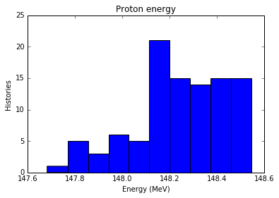
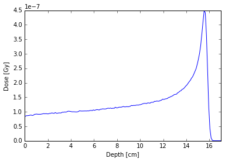
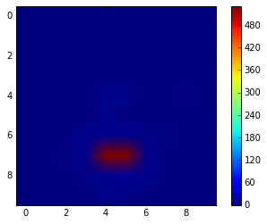

Usage
=====

Here are some examples of how to use ``topas2numpy`` in an IPython
notebook.

Before starting, we setup plotting with ``matplotlib``.

.. code:: python

    import numpy as np
    import matplotlib.pyplot as plt
    %matplotlib inline

Reading ntuples
---------------

TOPAS ntuples store data in columns, with each row representing a
different event in a particle's history. The exact details of what data
is written to file and when this is triggered depends upon the scorer
implementation.

``topas2numpy.read_ntuple()`` allows us to read TOPAS ntuples in ASCII,
binary and limited formats. It returns a `NumPy structured
array <http://docs.scipy.org/doc/numpy-1.10.1/user/basics.rec.html>`__.

Record arrays are not supported because TOPAS column name can contain
characters that are illegal for attribute names. If desired, I can add
this feature at the expense of changing column names.

Onwards to the example usage! First, we read in the data:

.. code:: python

    from topas2numpy import read_ntuple
    x = read_ntuple('../tests/data/ascii-phasespace.phsp')

Next, we want to check what columns are available in this ntuple:

.. code:: python

    x.dtype.names

.. parsed-literal::

    ('Position X (cm)',
     'Position Y (cm)',
     'Position Z (cm)',
     'Direction Cosine X',
     'Direction Cosine Y',
     'Energy (MeV)',
     'Weight',
     'Particle Type (in PDG Format)',
     'Flag to tell if Third Direction Cosine is Negative (1 means true)',
     'Flag to tell if this is the First Scored Particle from this History (1 means true)')

Now we want to make a histogram of the energy of the protons contained
in the ntuple. Note that the PDG code for protons is 2212.

.. code:: python

    energy_label = 'Energy (MeV)'
    species_label = 'Particle Type (in PDG Format)'

    energy = x[energy_label]
    species = x[species_label]
    proton_energy = energy[species==2212]

    n, bins, patches = plt.hist(proton_energy)
    plt.xlabel(energy_label)
    plt.ylabel('Histories')
    plt.title('Proton energy')

Reading binned results
----------------------

TOPAS scorers can also accumulate quantities within binned geometry
components. By default a sum is accumulated, but it is also possible to
accumulate additional statistics such as the mean, standard deviation,
etc.

As more metadata is available for binned scorers than ntuple scorers,
they are stored in an instance of the ``BinnedScorer`` class. The raw
data is still kept in a NumPy array, which is kept in the ``data``
attribute.

Our first example is a Bragg peak caused by a proton beam stopping in
water. First we read in the data and see what is available:

.. code:: python

    from topas2numpy import BinnedResult
    dose = BinnedResult('../tests/data/Dose.csv')

    print '{0} [{1}]'.format(dose.quantity, dose.unit)
    print 'Statistics: {0}'.format(dose.statistics)
    for dim in dose.dimensions:
        print '{0} [{1}]: {2} bins'.format(dim.name, dim.unit, dim.n_bins)

.. parsed-literal::

    DoseToWaterBinned [Gy]
    Statistics: ['Sum']
    X [cm]: 1 bins
    Y [cm]: 1 bins
    Z [cm]: 300 bins

Since the dose is only binned in the z-dimension, we can
``numpy.squeeze()`` the array to remove the other dimensions. Then we
plot the dose against the z distance (i.e. depth). In this example, only
the ``Sum`` statistic is available, but TOPAS can also provide
``Standard_Deviation``, etc.

.. code:: python

    ax = plt.subplot(111)
    z = dose.dimensions[2].get_bin_centers()
    plt.plot(z, np.squeeze(dose.data['Sum']))
    plt.xlabel('Depth [cm]')
    plt.ylabel('Dose [Gy]')
    ax.set_xlim(xmax=17)

Our second example is the number of tracks passing through a surface as
a beam of protons passes through a dipole magnet. The charged particles
are deflected by the Lorentz force. Let's investigate what data is
available.

.. code:: python

    ntracks = BinnedResult('../tests/data/SurfaceTracks.csv')

    print '{0} [{1}]'.format(ntracks.quantity, ntracks.unit)
    print 'Statistics: {0}'.format(ntracks.statistics)
    for dim in ntracks.dimensions:
        print '{0} [{1}]: {2} bins'.format(dim.name, dim.unit, dim.n_bins)

.. parsed-literal::

    SurfaceTrackCount [None]
    Statistics: ['Sum']
    X [cm]: 10 bins
    Y [cm]: 10 bins
    Z [cm]: 1 bins

So the number of tracks is scored on a two-dimensional surface and we
can plot this as an image.

.. code:: python

    plt.imshow(np.squeeze(ntracks.data['Sum']))
    plt.colorbar()

